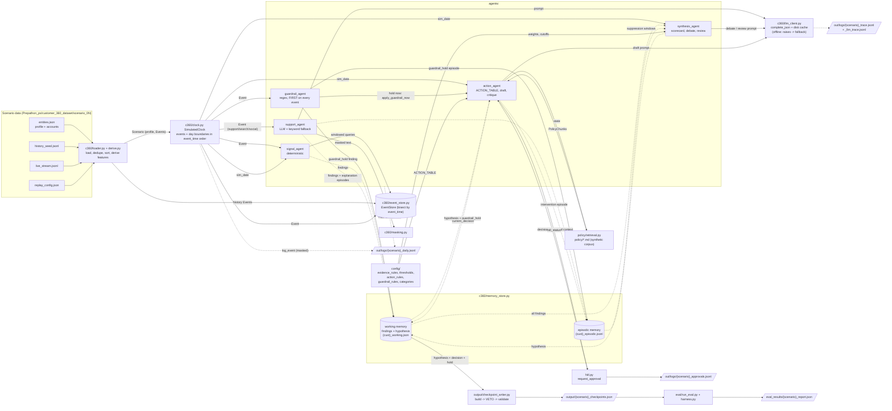

# Architecture

Drawn from the code as of this commit. Everything below exists in the repo; the
file that implements each box is named next to it.

**Arrows.** The replay (`run_skeleton.py`) is single-threaded, with no queues or
background workers. So in these diagrams:
- **solid** means a synchronous call, whose result is used before the caller
  continues (guardrail, veto, LLM, retrieval, HITL);
- **dotted** means a decoupled handoff through memory: one agent writes a finding
  now, and another reads it later at the day boundary. This is the only
  asynchronous-style link in the system.

Labels name the package that crosses the arrow.

## 1. System architecture



Notes:
- `tracing/tracer.py` `@traced` wraps the per-event and per-day callbacks, every
  agent's `on_event` / `on_day_boundary`, `LLMClient.complete_json`,
  `retrieval.retrieve`, `hitl.request_approval` and `CheckpointWriter.write`. Each
  call writes one span to `{scenario}_trace.jsonl`; that is left out of the
  diagram for readability.
- The guardrail's immediate checkpoint is written by `run_skeleton._on_event`
  right after `apply_guardrail_now`, at the event's own `event_time`.
- `GUARDRAILS_ENABLED=False` removes the guardrail agent and the veto; the rest
  of the graph is unchanged.
- No executor sends anything to a customer. In `--auto` mode HITL returns
  `escalated`, and the decision stays in memory and the logs.

## 2. Agents: tools, data and triggers

| Agent | Trigger | Allowed source_systems (`handles()`) | Reads | Writes | Tools |
|---|---|---|---|---|---|
| `guardrail_agent` (`agents/guardrail_agent.py`) | per event, first | `support_logs` (`GUARDRAIL_SOURCES`) | event free text (`derived.text_fields` / `raw_text`) | working: `guardrail_hold`; episodic: `guardrail_hold`; daily log | `config.guardrail_rules.match_rules` (regex, no LLM) |
| `signal_agent` (`agents/signal_agent.py`) | `on_start` (history baseline); per event; every day boundary | `card_payments`, `core_banking_ledger`, `instant_payments`, `ach_wire`, `loan_kyc`, `web_app_events` (`feature_used` only) | event payload + `derived`; `EventStore` windows | working: `baseline`, `large_purchase`, `large_inflow`, `outflow_pattern`, `standing_instruction_change`, `kyc_change`, `income_pattern`, `engagement_trend`, `card_activity_trend`, `merchant_shift`; first medium/high episode per key | `EventStore` queries, `config.thresholds`, `config.categories` |
| `support_agent` (`agents/support_agent.py`) | per event | `support_logs` (`ticket_created`, `ticket_resolved`, `call_transcript`), `web_app_events` (`search_query`), `social_signal_consented` (`life_event_mention`, only if `consent_flag`) | masked event text; its own recent support episodes; `EventStore` (to match an explained transaction) | working: `sentiment_state`, `relationship_damage`, `intent_signal`, `life_event_hint`; episodic: `support_ticket`, `explanation` (suppression) | `masking.mask`, `llm_client.complete_json` (fallback `keyword_fallback`) |
| `synthesis_agent` (`agents/synthesis_agent.py`) | day boundary, only when a finding changed (or a hold exists) | none (never sees raw events) | working: all findings; episodic: suppression windows | working: hypothesis; episodic: `debate`, `hypothesis_change` | `config.evidence_rules`, `config.thresholds`, `llm_client` (debate + review; fallbacks `_precedence_verdict`, `_fallback_rationale`) |
| `action_agent` (`agents/action_agent.py`) | day boundary after synthesis; immediately after a guardrail fire | none | working: hypothesis, `guardrail_hold`; episodic: open `intervention`, `explanation` (critique check c) | working: `current_decision`; episodic: `intervention` | `config.action_rules`, `policy.retrieval`, `llm_client` (draft/revision, template fallback), `hitl.request_approval`, `masking` |

Non-agent components:

| Component | Called by | Reads | Writes |
|---|---|---|---|
| `hitl.py` | action_agent | decision + masked `context_shown` | `{scenario}_approvals.jsonl` (request + decision lines) |
| `policy/retrieval.py` | action_agent | `policy/action_policy.md`, `policy/offer_catalog.md` | — |
| `output/checkpoint_writer.py` | `run_skeleton` (day boundary, guardrail fire, run end) | working: hypothesis, `current_decision`, `guardrail_hold` | `output/{scenario}_checkpoints.json` |
| `c360/llm_client.py` | support, synthesis, action | `out/llm_cache/` | `out/llm_cache/`, `{scenario}_llm_trace.jsonl` |

## 3. One simulated day

For day D, the clock first fires the boundary for D at 00:00, which closes out
D-1. Then it dispatches D's events in `event_time` order.

```mermaid
sequenceDiagram
    autonumber
    participant CL as SimulatedClock
    participant RS as run_skeleton
    participant SG as signal_agent
    participant SY as synthesis_agent
    participant AC as action_agent
    participant PR as policy.retrieval
    participant LM as llm_client
    participant HI as hitl
    participant WM as working memory
    participant CW as checkpoint_writer
    participant GD as guardrail_agent
    participant SU as support_agent
    participant ES as EventStore

    CL->>RS: day boundary(D) at 00:00
    RS->>SG: on_day_boundary(D)
    SG->>ES: trailing windows (engagement, card, merchant, SI, income)
    SG-->>WM: findings (only on change)
    RS->>SY: on_day_boundary(D)
    alt a finding is newer than the last pass, or a hold exists
        SY->>WM: all findings
        SY->>SY: score (noisy-OR, decay, suppression) and band
        opt near-tie or incompatible pair
            SY->>LM: debate (offline: precedence fallback)
        end
        opt state or band changed
            SY->>LM: review (can only lower the band)
        end
        SY-->>WM: hypothesis
    else nothing new
        SY->>SY: carried forward
    end
    RS->>AC: on_day_boundary(D)
    alt guardrail_hold present
        AC-->>WM: forced decision (escalated, no customer message)
    else open intervention within cooldown
        AC-->>WM: carry forward
    else ACTION_TABLE gives an action (band high)
        AC->>PR: retrieve(state)
        PR-->>AC: policy chunks
        AC->>LM: draft (offline: template)
        AC->>AC: critique, maybe revise
        AC->>HI: request_approval(decision, masked context)
        HI-->>AC: escalated (auto mode)
        AC-->>WM: current_decision + intervention episode
    else
        AC-->>WM: no_action / auto_approved
    end
    RS->>CW: write(D)
    CW->>WM: hypothesis, decision, hold
    CW->>CW: veto, then validate enums
    CW-->>RS: checkpoint as_of D 00:00

    loop each event on day D, in event_time order
        CL->>RS: event
        RS->>ES: add (idempotent, bisect)
        RS->>GD: on_event (support_logs only)
        opt a rule fires
            GD-->>WM: guardrail_hold
            RS->>AC: apply_guardrail_now
            RS->>CW: write(event_time)
        end
        RS->>SG: on_event (if handled)
        RS->>SU: on_event (if handled; masked text to LLM or keyword fallback)
    end
```
